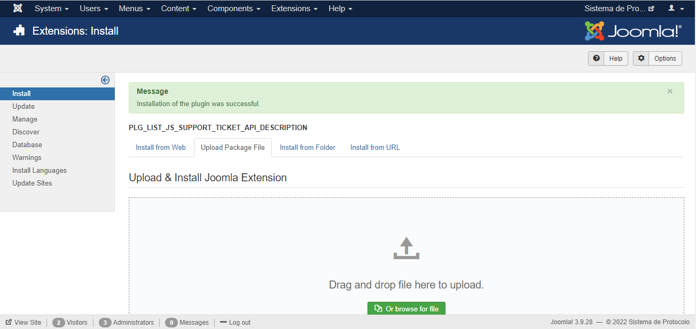
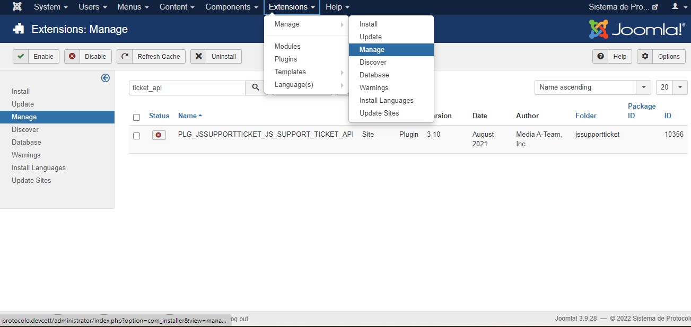
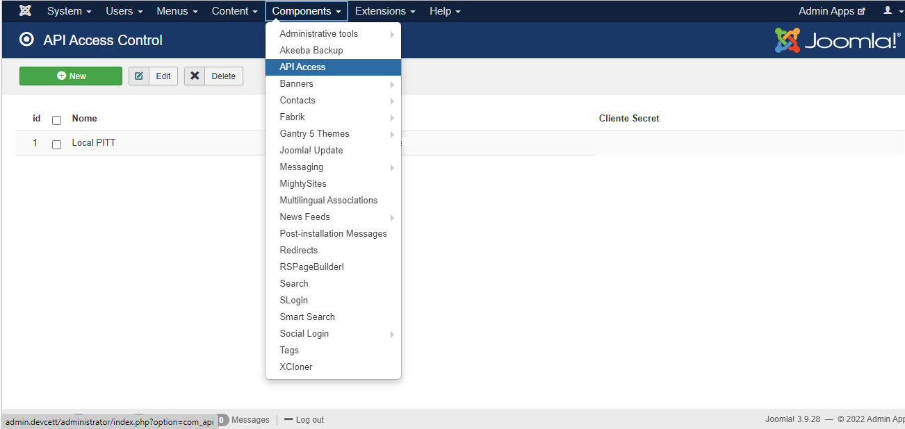
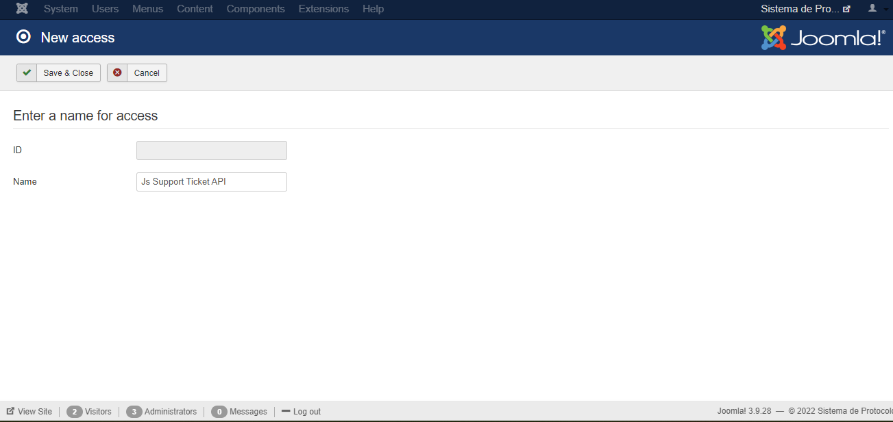

# Js_Support_Ticket_API

## Instalação

Primeiramente, deve-se instalar o plugin js_support_ticket_api. Para isso, em sua tela de administrador do Joomla vá em Extensions->Manage->Install e clique na aba Upload Package File como na imagem abaixo.

 

Após isso, basta navegar aos arquivos .rar da extensão necessária e arrastar para a caixa de seleção, se ocorrer tudo como esperado na instalação o resultado deve ser o seguinte.

 

## Configurações Inicias

Após a instalação é preciso realizar duas etapas de configurações e verificações básicas para o correto funcionamento da API.

 

<b>1. Verificar se a extensões instalada está desabilitada.</b>

Para isso vá em Extensions->Manage->Manage e na aba de pesquisa digite "API" e clique enter, como na imagem abaixo. Ao aparecer o componente instalado anteriormente verifique na coluna "Status" se ele está marcado como desabilitado, se não estiverem clique em cima do ícone para desabilitá-los, para que não aparece a resposta em json da API sempre que for aberto o plugin no front-end do componente.

 

<b>2. Adicionar nova chave de acesso à API</b>

Nesta etapa, como esta ilustrada na figura abaixo, é necessário ir em Components->API Access e clicar em New.

Se abrirá uma nova janela onde deverá ser preenchido o campo "Name" como identificação da chave de acesso exclusivamente para a API do JsSupportTicket, nesse sentido, sempre que necessário outra API distinta é recomendado criar novas credenciais de acesso. Preenchido o que se pede, como na ilustração, clique em "Save & Close".

Em seguida, voltando a tela anterior, deve ser vista a nova credencial de acesso para esta API. Os códigos nas colunas Client Id e Client Secret deverão ser enviados sempre nas requisições para que seja legitimada a operação.

## Utilização

 Com a instalação e todas as configurações iniciais realizadas corretamente nos passos anteriores a API já está funcionando adequadamente, desta forma, é importante entender como utilizá-la e o básico de seu funcionamento. 

Para realizar a requisição padrão da API deve-se ter o seguinte formato padrão de url inicial:

URL = Base(Variável) + Formatação(Fixo)

* <b>Base:</b> https://protocolo2.cett.dev.br
* <b>Formatação:</b> /plugins/jssupportticket/js_support_ticket_API/js_support_ticket_API.php

Com a url montada como o exemplo anterior já é possível acessar o arquivo principal do plugin diretamente, porém para realizar a requisição deve-se enviar no corpo da requisição os parâmetros dependendo do tipo de requisição a ser realizada, ou seja, há os parâmetros fixos e os variáveis.

Nesse sentido, o corpo da requisição deve ser no formato json com os índices "authentication" e "data" e dentro de cada índice deve conter os parâmetros, em formato json, com os seguintes índices: 

##### Authentication

* api_key: Valor encontrado na coluna "Client ID" da etapa 2 de configurações iniciais. (Fixo)
* api_secret - Valor encontrado na coluna "Client Secret" da etapa 2 de configurações iniciais. (Fixo)

##### Data

###### Tipo POST

Para este tipo de requisição é preciso apenas enviar os dados a serem adicionados em formato json, sendo o índice o nome da coluna da tabela e seu respectivo valor. Desta forma, sempre que forem adicionados novos campos ou colunas o padrão se mantem sempre o mesmo.

## Retorno da API

O formato padrão da resposta da API é em formato json contendo um índice "error" sendo true em caso de erro na requisição ou false em caso de sucesso da mesma. Entretanto, dependendo do tipo de requisição solicitada há outro índice no json chamado "msg" que possui mensagens de sucesso e erros apropriadas para cada solicitação, além do índice "ticketid" que contém o id do ticket alfanumérico recém criado via POST.
